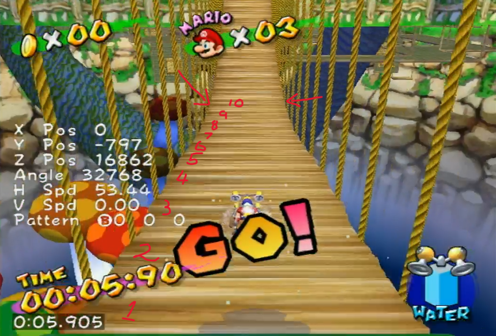

# Bridge Tripple



Bridge Tripple is the optimal strategy used for traversing the bridge in Pianta Village. It has 2 main parts:

1. The bridge slide
2. The tripple jump

## Initiating the slide
This might seem a bit tricky at first, but the bridge slide is very consistent if you know what to look for. As Mario spawns, start holding forward and analogue R. As soon as Mario has spawned, he will start spraying water at the bridge. As soon as Mario starts to walk, do a jump dive into the water. 

As long as you time the jump dive correctly and hold forward for the whole process, this should be 100% consistent. Feel free to experiment with the timing of the jump dive, it can be done before it becomes visually clear that Mario is moving.

## Tripple Jump
Change into the hover nozzle and hold R during the bridge slide. Notice the intervalling light and dark stripes along the bridge in the following image:

 By the 10th dark stripe, Mario will begin free falling. If you hold R at this point you will begin hovering. Quickly realease R, land on the bridge again and perform a double jump into tripple jump.

***DISCLAIMER**: IF YOU ARE NOT HOLDING R BY THE 10th DARK STRIPE, MARIO WILL CLIP THROUGH THE BRIDGE!*