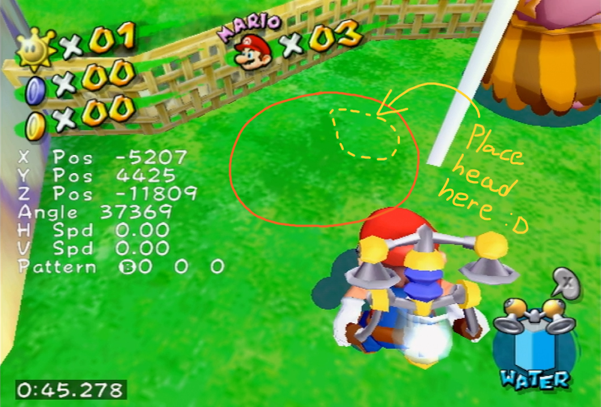
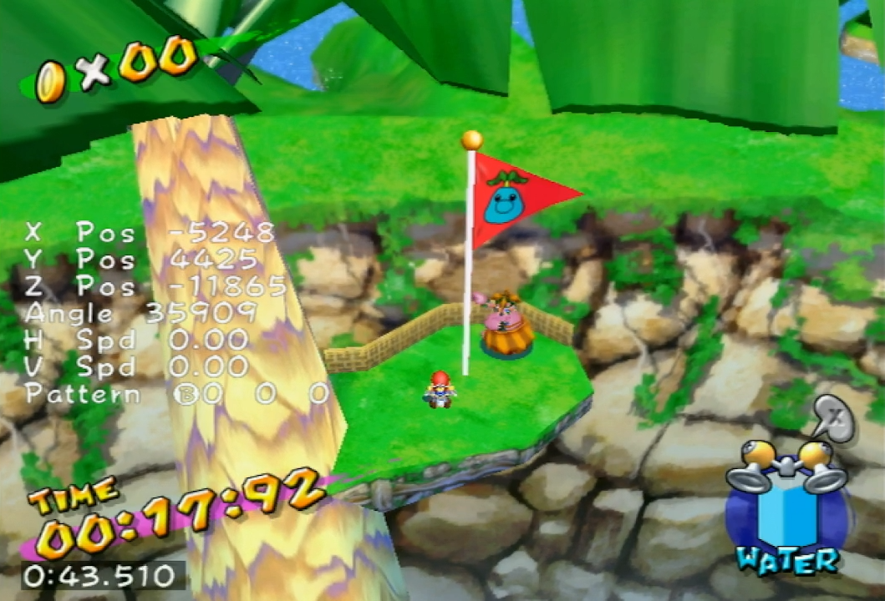
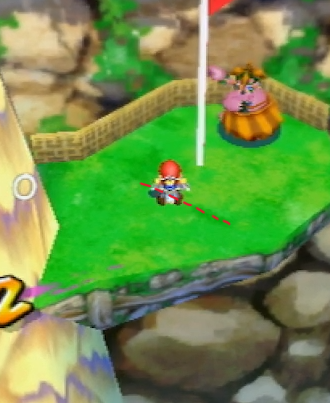

# Pianta 2 for any%



For a very long time, this level did not have a particular strategy. Aside from the optimal bridge movement used throughout the whole stage, you would just play the level without putting much thought or effort in what you were doing. However, after sign tech was discovered in 2023, Pianta 2 all of a sudden had an actual strategy to be used! Don't worry though, it's still *very* easy.

## Entry and race
Perform bridge tripple, hover cancel the tripple jump and talk to El Piantissimo. When the race starts, read the nearby sign. Finish the race by touching the flag pole...yeah not much detail is required here. El Piantissimo is very slow the first time you race him. Don't lose. I mean c'mon, just don't lose.

## Sign tech setup
For sign tech to work, Mario must be facing El Piantissimo. A setup is required to do it consistently, but there is enough leniency that most of the work can be eyeballed. Near the flagpole, look for this dark patch of grass (marked in orange):

If you position Mario such that his head is next to the concaved part on the right side of the shape (marked in yellow), you should be all set. The final result should look something like this:

Notice how Mario's head has only started to enter the shape. This is done so that he is not to far away from the shine. By placing Mario like this, a groundpound to collect the shine can be done immediately after it spawns. There isn't much need for presicion here, but a visual cue can be used for good measure. In the previous image, notice the thick dark line positioned 4 o' clock of Mario. If you imagine that line continues, place Mario's bottom half such that the line intersects it:

At this point, wait for El Piantissimo and spam through his text (the first 2 lines should be fast if the setup was done correctly). Collect the shine.