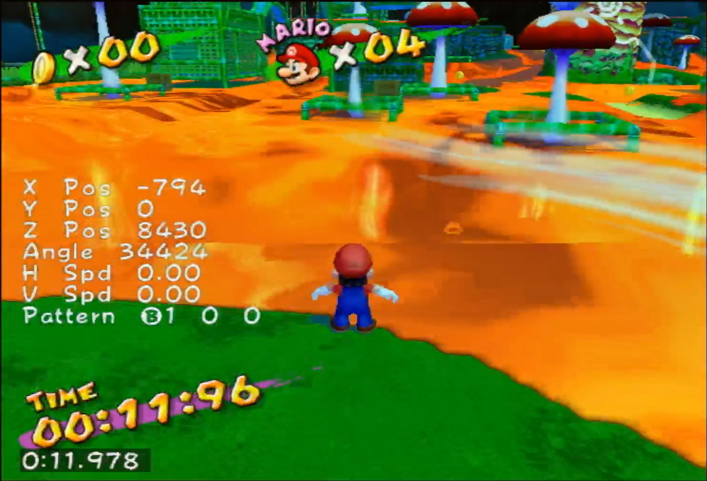
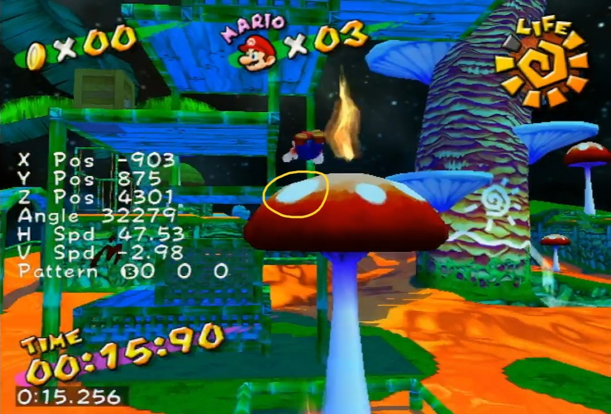
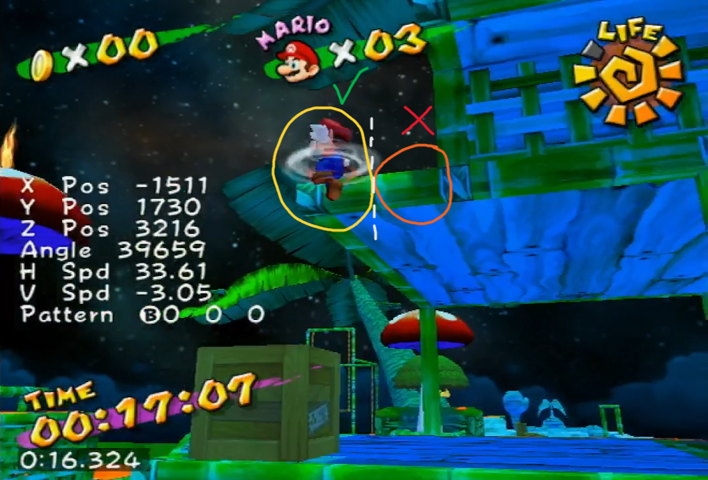
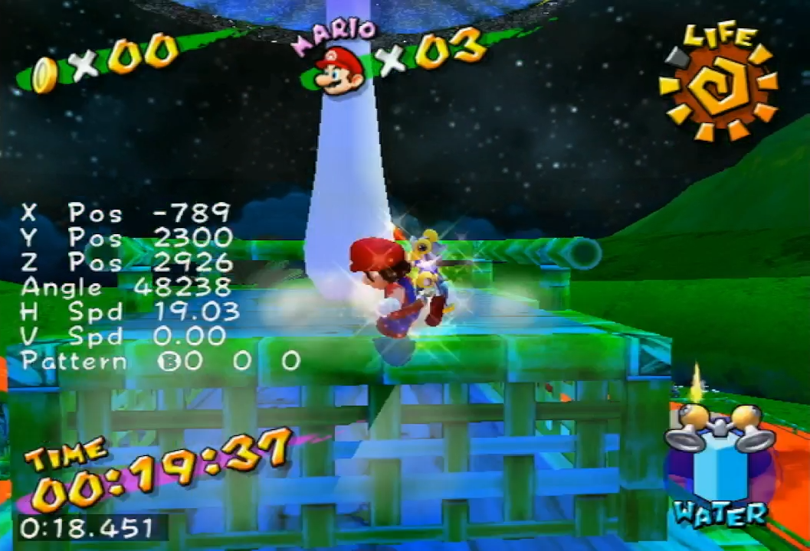

# Pianta 3 - Mushroom + GWKD

These are my personal notes for Pianta 3, and many claims that are made here will likely lack evidence to back them up. The strategies, visual cues etc. that are recommended in this documment should therefore not be considered as a “fool proof” or "be-all and end-all" methodology for playing this level.

## Video
https://www.youtube.com/watch?v=SSwOG_2nQko

## Bridge Movement
Shorthop > Dive > Big rollout > Dive > Rollout > SJD (adjust camera to the left) > Rollout > TJD. 

Finish with a rollout over the railing and prepare for the windpush.

## Windpush
The windpush can seem random at times, but I believe if all the previous movement is done consistently, then you should always be able to get a good windpush given you have positioned yourself correctly (I don't have concrete evidence for this claim, keep in mind).

### Positioning
I find that several visual ques can be used for a good windpush. The following image shows my preffered spot:

Notice the staircase shape of the lavas outline near Mario. I like to stand near the first step of the staircase from the left. Again, I find multiple positions for Mario could work, so there is a lot of leniency here. Therefore, I urge players to experiment and see if they find other visual cues more prefferable.

Make sure to place Mario as close to the lava as possible, as to maximize the distance gained from the windpush. In the image shown previously, Mario could be a lot closer to the lava. It is possible to place Mario such that his feet are right on top of the lava texture, without taking damage. 

### Hold forward
#### **DISCLAIMER**: THIS IS A VERY IMPORTANT DETAIL! THE VIABILITY OF THE STRAT RELIES ON IT!

Right before getting hit by the wind, hold forward. This forces Mario to fall forward, allowing you to gain more distance. 

Generally speaking, you will be pushed forward if you do this correctly. However, as there will be inconsistencies with every attempt, your positioning and how the wind hits Mario will vary and thus Marios falling trajectory will also vary somewhat. You will simply need to practice this a lot, try to do everything in a uniform way and learn to deal with varying outcomes. 

## Lava Movement
During Mario's get-up animation after windpush, buffer a spinput, hold forward (towards the railing of the second mushroom) and perform a SJD just as Mario turns. Finish with a big rollout onto the railing.

It is very important that this movement is done correctly, as you will need to gain as much distance as you can. Failing to get enough distance could result in the later stages of the level to fail. 

You may need to carefully adjust the camera during this phase. This is best left up to practice, as how much you need to adjust your camera can vary with every attempt.

## Railing
Right before landing on the railing, adjust the camera and buffer a spinput to prepare for a SJD to the big mushroom. Make sure to use the space on the railing to your advantage by taking a few extra steps if you didn't get enough distance post damage boost. 

The limited space on the railing can make it easy to unintentionally run off into the lava. This makes it important to **IMMIDIETELY** hold the controlstick in the direction of the big mushroom. Doing this too slowly could result in Mario running just slighly in the direction you were holding after the spinput, and ending up in the lava.

## Momentum Spin
When doing the momentum spin off the mushroom, a good visual cue for where to land is to look for the left most white spot:

## GWKD
Perform the GWKD on the left side of the ledge, as being too far to the right can cause you to bonk and fall to the ground:

## Post FLUDD/Mayor Clean
Aim towards FLUDD during the dive, and perform a groundpound when above him. Perform a sideflip from the following position:

Grab the ledge of the gold mushroom and get up. While doing a small jump towards the mayor, perform 2 (or more) spam sprays. Keep spraying water in case the mayor isn't clean. Talk to the mayor and get the shine.

If you ever play this level and you find yourself confused as to what you are losing time to, it is probably the clean. This is why it is important to do at least 2 spam sprays, and to aim towards and get close to the mayor as to ensure most water particles hit him.

## Personal Notes
This shine is quite tricky as it is, and these strats demand even more technical ability out of the player. However, getting a hang of everything will make this shine so much more fun and exciting! I recommend adding theses strats to RTA when ready. Also, practice practice practice! There is LOTS of room for optimization here! This strat can net you anything between a low 30 and a high 28 IL time!